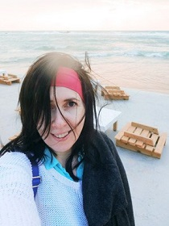

# Olga Savchenko
## Illustrator, future Frontend Developer

## Contact information:
* **E-mail:** indi@academ.org
* **Diskord nickname:** Olga (@IndigoBetta)

## About myself:
For many years I've been working as a freelancer illustrator. When I was no longer interested in this, I decided to learn skills in(?) the sphere I've (?) wanted to learn for a long time.I plan to become a good frontend developer.

## Skills:
Adobe Photoshop, Illustrator, InDesign;
CorelDRAW;
HTML, CSS (in progress);
JavaScript Basics (in progress)

## Опыт работы:
ссылка на CV

## Courses:
RS Schools Course «JavaScript/Front-end. Stage 0» (in progress)

## Languages:
English: Elementary
Russian: Native